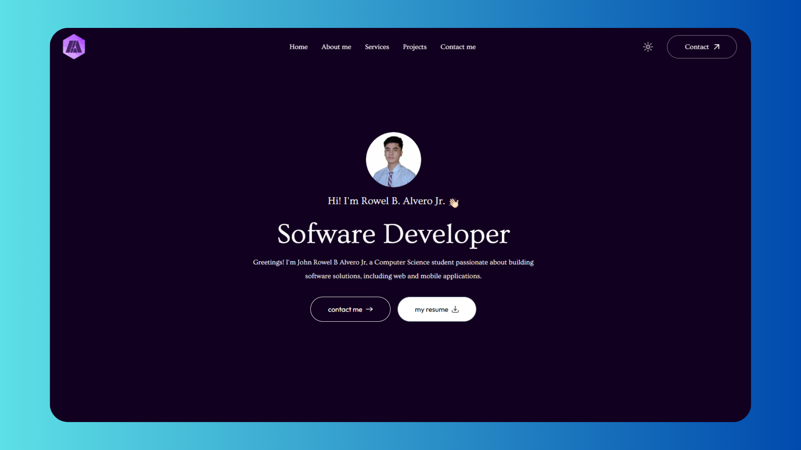

# 💻 Rowel Alvero Jr. — Personal Portfolio Website

[](https://nextjs.org/)
[](https://react.dev/)
[](https://tailwindcss.com/)
[](https://motion.dev/)
[](https://vercel.com/)
[](LICENSE)

A modern, responsive, and beautifully animated portfolio website built with **Next.js 15**, **React 19**, **Tailwind CSS v4**, and **Motion** (Framer Motion). This project serves as a central hub to showcase my skills, projects, education, and services as a Software Engineer.

---

## 🌟 Preview



---

## 📖 Table of Contents

- [✨ Key Features](#-key-features)
- [🛠️ Tech Stack & Technologies](#️-tech-stack--technologies)
- [📂 Project Structure](#-project-structure)
- [🎯 Featured Projects](#-featured-projects)
- [💻 Getting Started](#-getting-started)
  - [Prerequisites](#prerequisites)
  - [Installation & Setup](#installation--setup)
  - [Available Scripts](#available-scripts)
- [📩 Contact & Socials](#-contact-&-socials)
- [📄 License](#-license)

---

## ✨ Key Features

*   **🌗 Dynamic Dark Mode:** Seamlessly toggles between light and dark modes with local storage persistence and automated system preference detection.
*   **🎭 Smooth Motion Animations:** Powered by `motion` (Framer Motion) for beautiful page entries, hover micro-interactions, scroll-triggered fade-ins, and spring transitions.
*   **⌨️ Interactive Typing Effect:** The hero header includes an elegant self-typing and deleting animation highlighting my key roles (Web, React, and Software Developer).
*   **🖥️ Fully Responsive Layout:** Tailored with a custom side menu navigation drawer that feels intuitive and clean on mobile devices, tablets, and desktops.
*   **📬 Integrated Contact Form:** Connected directly with **Web3Forms** to send contact form submissions directly to my inbox without needing a dedicated backend.
*   **💡 Performance Optimized:** Leverages Next.js's `next/font` for optimizing Google Fonts (*Outfit* and *Ovo*), responsive Next.js `Image` assets, and optimized layouts.

---

## 🛠️ Tech Stack & Technologies

### Frontend & Core
*   **Framework:** [Next.js 15](https://nextjs.org/) (App Router)
*   **Library:** [React 19](https://react.dev/)
*   **Styling:** [Tailwind CSS v4](https://tailwindcss.com/) & [PostCSS](https://postcss.org/)
*   **Animations:** [Motion (Framer Motion v12)](https://motion.dev/)

### My Complete Developer Tech Stack (Showcased in site)
*   **Programming Languages:** Python, C, C#, Java, JavaScript, TypeScript, PHP, Dart
*   **Frontend Frameworks:** React.js, Vue.js, Next.js, Tailwind CSS, Bootstrap, Flutter
*   **Backend & API Frameworks:** Node.js, Laravel, Flask, ASP.NET
*   **Database Management:** PostgreSQL, MySQL, MSSQL, Firebase
*   **Cloud & Deployment:** Azure, Vercel, Firebase
*   **Development Tools:** VS Code, PyCharm, Visual Studio, Android Studio, Unity, Git/GitHub, Figma

---

## 📂 Project Structure

Here is a simplified overview of the portfolio repository structure:

```text
myportfolio/
├── app/
│   ├── components/            # Reusable UI component files
│   │   ├── About.jsx          # Education, bio, and background details
│   │   ├── Contact.jsx        # Contact form with Web3Forms
│   │   ├── Footer.jsx         # Footer credits and social profile links
│   │   ├── Header.jsx         # Hero section with animated typing text
│   │   ├── Navbar.jsx         # Scroll-adaptive, responsive navbar
│   │   ├── Services.jsx       # Overview of services offered
│   │   ├── TechStacks.jsx     # Categorized grid of logos and tech skills
│   │   └── Work.jsx           # Cards displaying featured projects
│   ├── favicon.ico
│   ├── globals.css            # Base Tailwind imports and utility classes
│   ├── layout.js              # Next.js root layout with google fonts
│   └── page.js                # Main page entry combining all sections
├── assets/
│   └── assets.js              # Asset dictionary, links, project data arrays
├── public/                    # Static image/PDF assets (screenshots, resumes)
├── package.json               # Dependencies and script definitions
├── next.config.mjs            # Next.js bundler and compiler configs
├── tailwind.config.js         # Tailwind styling themes
└── eslint.config.mjs          # JavaScript linting settings
```

---

## 🎯 Featured Projects

The website highlights the following major projects built throughout my academic and developer journey:

1.  **EatsEasy (CS Thesis Project) 🍔**
    *   **Description:** A cross-platform food ordering system allowing food combinations and customization. Connects users with local restaurants for seamless ordering.
    *   **Tech Stack:** Flutter, Node.js, MongoDB, Firebase
    *   **Status:** Completed
    *   **Repository:** [EatsEasy-Food-Application](https://github.com/rowelalvero/EatsEasy-Food-Application)

2.  **PetVax 🐾**
    *   **Description:** A multi-vendor veterinary services platform connecting pet owners with veterinary professionals for consultations, vaccinations, and products.
    *   **Tech Stack:** Laravel, PHP, Vue.js, Node.js, MySQL
    *   **Status:** Ongoing
    *   **Repository:** [petvax-clinic-admin](https://github.com/rowelalvero/petvax-clinic-admin)

3.  **PUPFoodFinds 🏫**
    *   **Description:** A campus-focused e-commerce food ordering app for the Polytechnic University of the Philippines, streamlining campus food selection and digital transactions.
    *   **Tech Stack:** C#, ASP.NET, MySQL
    *   **Status:** Completed
    *   **Repository:** [EatsEasy-Food-Application](https://github.com/rowelalvero/EatsEasy-Food-Application) (Alternative Mirror)

4.  **Elementals: The Game 🎮**
    *   **Description:** A 2D platformer game where players control a character with elemental powers to navigate levels, solve puzzles, and defeat enemies.
    *   **Tech Stack:** Unity, C#, Git
    *   **Status:** Completed
    *   **Repository:** [Elemental](https://github.com/rowelalvero/Elemental)

5.  **My Portfolio 💻**
    *   **Description:** This personal portfolio site! Built to showcase my developer journey, skills, and projects in one polished interface.
    *   **Tech Stack:** React, Next.js, Tailwind CSS, Vercel
    *   **Status:** Completed
    *   **Repository:** [myportfolio](https://github.com/rowelalvero/myportfolio)

---

## 💻 Getting Started

Follow these steps to run the portfolio website locally on your machine.

### Prerequisites
Make sure you have [Node.js](https://nodejs.org/) installed (version 18.x or later is recommended).

### Installation & Setup

1.  **Clone the repository:**
    ```bash
    git clone https://github.com/rowelalvero/myportfolio.git
    cd myportfolio
    ```

2.  **Install dependencies:**
    ```bash
    npm install
    ```

3.  **Run the local development server:**
    ```bash
    npm run dev
    ```

4.  **View in browser:**
    Open [http://localhost:3000](http://localhost:3000) to inspect the website in action.

---

### Available Scripts

In the project directory, you can run:

*   `npm run dev` - Runs the app in development mode with Next.js Turbopack.
*   `npm run build` - Builds the production bundle of the application.
*   `npm run start` - Runs the built application in production mode.
*   `npm run lint` - Runs ESLint to check for code quality and styling violations.

---

## 📩 Contact & Socials

I am always open to discussing new opportunities, collaborations, and projects! Feel free to reach out to me via any of the platforms below:

*   **📧 Email:** [rjalvero90@gmail.com](mailto:rjalvero90@gmail.com)
*   **💼 LinkedIn:** [Rowel Alvero Jr.](https://www.linkedin.com/in/rowel-alvero-41133233b/)
*   **🐙 GitHub:** [@rowelalvero](https://github.com/rowelalvero)
*   **👥 Facebook:** [Rowel B. Alvero Jr.](https://www.facebook.com/rowelvero/)

---

## 📄 License

This project is licensed under the MIT License. See the [LICENSE](LICENSE) file for more details.
